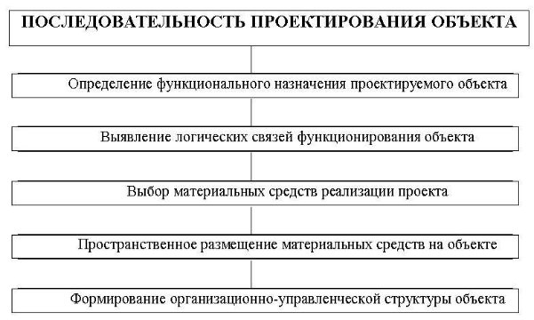

***Тема.* ПРОЕКТИРОВАНИЕ АИС** 

***1. Построение модели информационной системы организации***

*Процесс автоматизации деятельности организации:* 

1. *Первая стадия анализа* - структурный анализ предприятия - начинается с исследования того, как организована система управления предприятием, с обследования функциональной и информационной структур системы управления, определения существующих и возможных потребителей информации. По результатам обследования аналитик на первой стадии анализа выстраивает обобщенную логическую модель исходной предметной области, отображающую ее функциональную структуру, особенности основной деятельности и информационное пространство, в котором эта деятельность осуществляется. На этом материале аналитик строит функциональную модель "Как есть" (As Is). 
1. *Вторая стадия работы*, к которой обязательно привлекаются *заинтересованные представители заказчика*, а при необходимости и независимые эксперты, состоит в анализе модели *"Как есть"*, выявлении ее недостатков и узких мест, определении путей совершенствования системы управления на основе выделенных критериев качества. 
1. *Третья стадия анализа*, содержащая элементы проектирования, - создание усовершенствованной обобщенной логической модели, отображающей реорганизованную предметную область или ее часть, которая подлежит автоматизации - модель *"Как должно быть"* (As To Be). 
1. *Четвертая стадия* - разработка "Карты автоматизации", представляющей собой модель реорганизованной предметной области, на которой *обязательно обозначены "границы автоматизации"*. 

**Рис.** Стадии построения модели информационной системы 

2. ***Проектирование информационных систем*** 

***Проектирование** —* разработка принципов построения и эффективного функционирования систем,  процессов  и  др.  Это  процесс  обоснованного  выбора  характеристик  системы, формирования  логико-математических  и  экономико-математических  моделей,  разработки документации. 

Деятельность,  направленная  на  создание  АИС,  называется ***разработкой*** и (или) ***проектированием АИС**.*** 

**Проектирование  информационных  систем**  —  процесс  создания  и  внедрения  проектов комплексного  решения  экономических  задач  по  новой  технологии,  т.е. детальная разработка отдельных проектных решений, их анализ, апробация и внедрение.  

Разработка  и  проектирование  АИС  начинается  с  создания  концептуальной  модели использования  системы.  Прежде  всего,  должна  быть  определена  целесообразность  создания системы, ее конкретные функции и подлежащие автоматизации задачи. Далее проводится анализ требований  к  АИС,  детальное  проектирование,  взаимосвязь  этапов,  программирование  и тестирование, минимизация потерь при переходе от одного уровня представления информации к другому, интеграция в существующую систему, внедрение и поддержка. 

*Рисунок 1. Проектирование информационных систем*  

В каждом подразделении организации должен быть назначен сотрудник, *ответственный за проектирование и внедрение АИС*, который собирает нужную информацию, подбирает технику и программные  средства,  ведет  обучение  персонала,  руководит  внедрением  и  анализом функционирования информационных систем. 

3. ***Последовательность разработки АИС***  

Существует  множество  методов  и  вариантов  разработки  АИС,  использование  которых зависит от различных факторов, например, размеров предприятий и (или) их ИС, целей создания ИС, имеющихся ресурсов и др.  

*Проектирование* любого объекта осуществляется с:  

а) *определения* его *функционального назначения* (зачем нужен, что и как делает проектируемый объект),  

б)  *выявления*  *логических  связей*  (как  осуществляет  своё  функциональное  назначение проектируемый объект, какая информация и в какой последовательности обрабатывается), 

в)  *выбора  материальных  средств*  реализации  проектируемого  объекта  –  функционально- технологический и технический аспект (носители, средства обработки данных и др.), 

г)  *пространственного*  (территориального)  *размещения*  материальных  средств  реализации  на выделенных или возможных для использования площадях,  

д) *формирования организационно-управленческой структуры* проектируемого объекта (состав подразделений, полномочия и функциональные обязанности работников) 

После выбора метода проектирования АИС необходимо спланировать комплекс работ по созданию системы в соответствии с типовыми этапами её разработки. Проект рассматривается и утверждается Заказчиком. Проектирование АИС предполагает выполнение определённых стадий и этапов.  

4. ***Этапы проектирования АИС***  

Для  автоматизации  различных  видов  деятельности  (управление,  проектирование, исследование  и  т.п.),  включая  их  сочетания,  используют  положения  **ГОСТ  34.601-90**.  Он предусматривает различные стадии и этапы проектирования. 

*Стадия  создания  автоматизированной  системы  —*  часть  процесса  создания  АС, установленная нормативными документами и заканчивающаяся выпуском документации на АС, которая должна содержать модель системы на уровне данной стадии, изготовление несерийных компонентов или приемку АС в эксплуатацию. 

Каждая  стадия  выделена  по  соображениям  рационального  планирования  и  организации работ и обязательно должна заканчиваться определенным результатом. Содержание документации на каждой стадии определяется составом и спецификой работ. 

ГОСТ 34.601-90 предусматривает следующие стадии и этапы проектирования: 

|**Стадии**  |**Этапы**  |
| - | - |
|**1. Формирование требований к АС**  |
1.1. Обследование объекта и обоснование необходимости создания АС  

1.2. Формирование требований пользователя к АС  

1.3. Оформление отчёта о выполненной работе и заявки на разработку АС  
|
|**2. Разработка  концепции АС**  |
2.1. Изучение объекта  

2.2. Проведение необходимых научно-исследовательских работ  

2.3. Разработка вариантов концепции АС и выбор варианта концепции АС, удовлетворяющей пользователя  

2.4. Оформление отчёта о выполненной работе  
|
|**3. Техническое  задание**  |3\.1. Разработка и утверждение технического задания на создание АС  |
|**4. Эскизный проект**  |
4.1. Разработка предварительных проектных решений по системе и её частям;  

4.2. Разработка документации на АИС и её части  
|
|**5. Технический проект** |
5.1 Разработка проектных решений по системе и ее частям; 

5.2 Разработка документации на АИС и ее части; 

5.3 Разработка и оформление документации на поставку комплектующих изделий; 

5.4 Разработка заданий на проектирование в смежных частях проекта. 
|
|**6. Рабочая документация**  |
6.1. Разработка рабочей документации на систему и её части  

6.2. Разработка или адаптация программ  
|
|**7. Ввод в действие**  |
7.1. Подготовка объекта автоматизации к вводу АС в действие  

7.2. Подготовка персонала  

7.3. Комплектация АС поставляемыми изделиями (программными и техническими средствами, программно- техническими комплексами, информационными изделиями)  

7.4. Строительно-монтажные работы  

7.5. Пуско-наладочные работы  

7.6. Проведение предварительных испытаний  

7.7. Проведение опытной эксплуатации  
|

||7\.8. Проведение приёмочных испытаний  |
| :- | - |
|**8. Сопровождение АС**  |
8.1. Выполнение работ в соответствии с гарантийными обязательствами  

8.2. Послегарантийное обслуживание  
|

*Техническое  задание  —*  это  перечень  основных  эксплуатационных,  технологических экономических и других требований, которым должен удовлетворять проектируемый объект на всех этапах его существования.* 

*Технический  проект*  содержит  принципиальные  электрические  схемы  и  конструкторскую документацию объекта разработки и составные его части, перечень выбранных готовых средств программного  и  технического  обеспечения  (в  том  числе  типов  ЭВМ,  операционной  системы, прикладных  программ  и  т.д.),  алгоритмы  решения  задач  для  разработки  новых  средств программного обеспечения).*  

*Рабочий  проект*  –  заключительный  этап  проектирования,  в  общем  случае предусматривающий  уточнение  и  детализацию  результатов  предыдущих  этапов,  создание  и испытания  опытного  образца  объекта  автоматизации,  разработку  и  отработку  программных продуктов, технологической и эксплуатационной документации.  

Можно выделить ***три периода создания системы***:  

1) предпроектный (стадии 1, 2, 3) 
1) проектирование (стадии 4, 5, 6) 
1) ввод в эксплуатацию (стадии 7, 8) 

Для небольших проектов количество стадий может быть сокращено.  
