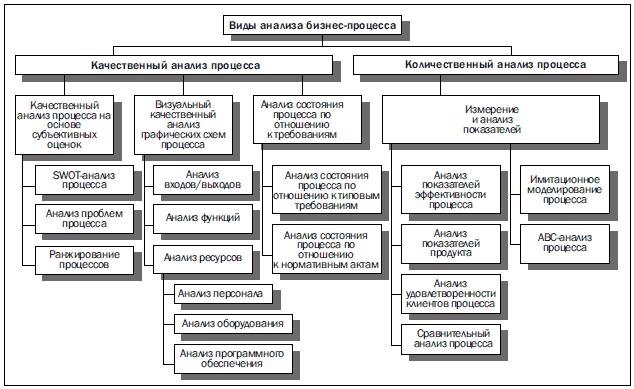

**Анализ бизнес-процессов и моделирование** 

В настоящее время постепенно развивается новый подход к управлению – процессный. Этот  подход  ориентирует  на  управление  не  отдельными  структурными  подразделениями предприятия,  выполняющими  свои  функциональные  обязанности,  а  сквозными  бизнес- процессами. 

Под  ***бизнес-процессом***  понимается  совокупность  действий,  выполнение  которых позволяет получить конечный результат (товар или услугу). 

Бизнес-процессы состоят из *бизнес-операций*, выполняемых с помощью АРМ. 

Каждый бизнес-процесс характеризуется определенным во времени началом и концом, интерфейсом с другими процессами. Например, бизнес-процесс «Производство» обслуживают специалисты из производственного, финансового и других отделов. 

Управление  бизнес-процессами  предполагает  рассмотрение  всех  материальных, финансовых,  трудовых  и  информационных  потоков  с  системных  позиций,  т.е.  во взаимодействии. Достижения в области ИС и ИТ дают возможность проведения инжиниринга и реинжиниринга бизнес-процессов. 

Целью  *реинжиниринга  бизнес-процессов*  (РБП)  является  системная  реорганизация материальных,  финансовых  и  информационных  потоков,  направленная  на  упрощение организационной  структуры,  перераспределение  и  минимизацию  использования  различных ресурсов,  сокращение  сроков  реализации  потребностей  клиентов,  повышение  качества  их обслуживания. 

***Реинжиниринг  бизнес-процессов***  –  это  создание  новых,  более  эффективных  бизнес- процессов  без  учета  предшествующего  развития  (все  начинается  заново,  подвергается сомнению, проявляется творческое начало во всех действиях). 

Технология реинжиниринга основана на том, что в процессе управления пользователь активно использует современные информационные технологии для обучения, стратегического и  тактического  планирования,  анализа  возможных  путей  перестройки  и  улучшения  бизнес- процессов, управления изменениями, реализацию проектов и др. 

*Инжиниринг  бизнес-процессов*  включает  в  себя  реинжиниринг  бизнес-процессов, проводимый с определенной периодичностью, например, один раз в 5 - 7 лет, и последующее непрерывное улучшение. 

*Обратный инжиниринг* предполагает исследование функционирующих на предприятии бизнес-процессов.  Цель  этапа  заключается  в  проведении  диагностики  «узких  мест»  в организации  существующих  бизнес-процессов  и  формулировании  направлений  их реорганизации.  

Для  оценки  эффективности  существующих  бизнес-процессов  используются  прежде всего методы и средства для выявления: 

Информационные  системы  создаются  для  решения  проблем  бизнеса  посредством современных информационных технологий. 

Модель  предприятия  имеет  иерархическую  структуру,  где  каждый  вышестоящий уровень является контекстом необходимым для существования нижестоящего. 

`         `*Моделирование бизнес-процессов* – это эффективное средство поиска путей оптимизации деятельности компании, средство прогнозирования и минимизации рисков, возникающих на различных этапах реорганизации предприятия. Этот метод позволяет дать стоимостную оценку каждому  отдельному  процессу  и  всем  бизнес-процессам  организации  в  совокупности.  

**Под  методологией  создания  модели  бизнес-процесса**  понимается  совокупность способов, при помощи которых объекты реального мира и связи между ними представляются в виде модели. Основное в методологии – дать пользователю последовательность шагов, которые приводят к заданному результату. Способность получать результат с заданными параметрами и характеризует ее эффективность. 

Важнейшими  понятиями  любого  метода  моделирования  бизнес-процессов  являются понятия *объекта* и *связи*. Каждый *объект* модели отражает некоторый реальный объект так называемой предметной области (организации), люди, документы,  машины и оборудование, программное  обеспечение  и  т.  д.  *Связи*  предназначены  для  описания  взаимоотношений объектов  друг  с  другом.  К  числу  таких  взаимоотношений  могут  относиться: последовательность  выполнения  во  времени,  связь  при  помощи  потока  информации, использование другим объектом и т. д.  

Для каждого объекта и связей характерны ряд параметров, или, как принято говорить, **атрибутов**, отражающих определенные характеристики реального объекта. Состав атрибутов зависит  от  типа  отображаемого  при  помощи  модели  реального  объекта  организации. Атрибутами  могут  служить  такие  характеристики,  как  номер  объекта,  название,  описание, длительность выполнения (для функций), стоимость и др.  

*Модель бизнес-процессов* является упрощенной копией самой компании: происходящих в ней бизнес-процессов (действий, функций, задач, обязанностей, постоянно происходящих в компании) и их взаимосвязей. 

*Модель  бизнес-процессов*  представляется  в  виде  набора  схем  и  таблиц,  где  схема является графическим изображением наиболее важных параметров процессов, а все параметры указываются в таблицах.  

**Шаги по решению задачи по моделированию бизнес-процессов:**  

1. Начальный  опрос  собственника  (первого  лица)  компании  и  ключевых 

сотрудников  

2. Подготовка черновой версии бизнес-процессов компании "как должно быть", в 

которую входит: - описание и параметры бизнес-процессов в виде таблиц:  

- название  процесса,  что  на  входе,  что  на  выходе,  ответственное  лицо,  сроки, 

критерии качества и т.д.  

- графические изображения процессов;  
3. рекомендации  по  оптимизации  бизнес-процессов,  в  том  числе  по 

организационной  структуре,  варианты  решений  по  оптимизации,  перечень  документов  для разработки, перечень замечаний и предложений.  

4. Обсуждение модели и ее корректировка.  
4. Тестовое  внедрение  и  практическое  усовершенствование  модели  бизнес-

процессов.  

6. Подготовка должностных инструкций и других регламентирующих документов. В дальнейшем обновление модели процессов происходит в соответствии с развитием 

компании. 

Необходимость  в  моделировании бизнес-процессов заключена  в  улучшении  работы всего предприятия, для этого применяются различные модели, которые дают понять основные этапы процессов и устранить ненужные или слабые стороны. 

**Моделирование состоит из нескольких последовательных стадий:** 

- Определение процессов и построение начальной модели, как на самом деле; 
- Диагностика, изучение и улучшение построенной модели; 
- Разработка модели с исправлениями; 
- Ее тестирование и применение; 
- Исправление ошибок. 

Моделирование складывается из 3 видов: 

- ***Функциональное  моделирование***,  в  котором  описываются  все  функции 

предприятия,  как  они  есть  и  их  взаимосвязь,  при  этом  соблюдение  последовательности  не обязательно; 

- ***Объективное,*** описывает бизнес-процессы, как взаимосвязанные объекты; 
- ***Имитационное***,  предполагает  построение,  моделирование  всех  процессов 

предприятия.
